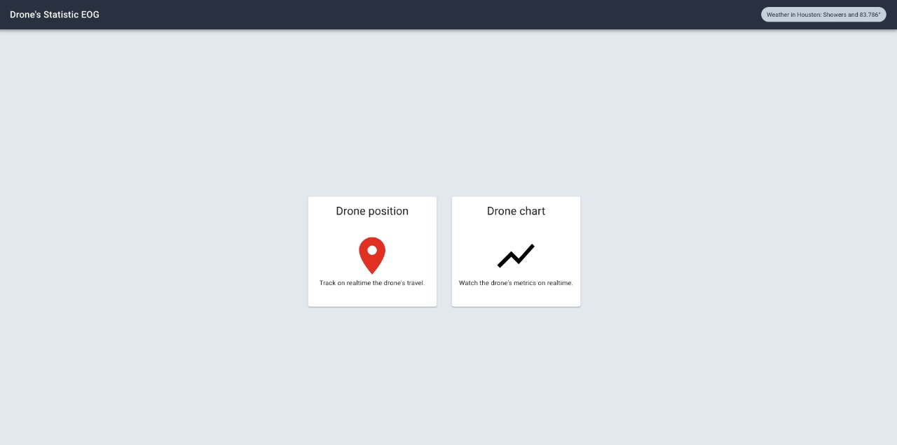

# Drone statistics

Drone's app to check some metrics and position on realtime.

## How does it work ?

Require Node.js v10

- `npm install` to install project on local.
- `npm start` to run the project

## LiveDEMO

[Drone App](https://drone-app.hflores.now.sh/)

## Liscense

MIT